# Trading Bot Architecture

## Overview

This document describes the hierarchical decision tree architecture used by the options trading bot. The system employs a **nested strategy pattern** where routing decisions cascade from broad market regime detection down to strategy-specific optimizations.

## Architecture Diagram

```mermaid
flowchart TD
    subgraph Level1["Level 1: Market Regime (Brain)"]
        BRAIN[("🧠 Brain<br/>_select_strategy()")]
        VIX[VIX Level]
        VEL[Velocity]
        ZSCORE[Z-Score]
        ADX[ADX/Trend]
    end

    subgraph Level2["Level 2: Strategy Selection"]
        GS["⚡ Gamma Scalper<br/>(Explosive Moves)"]
        VS["📈 Vega Snap<br/>(Vol Regime Change)"]
        DS["🎯 Delta Surfer<br/>(Trend Following)"]
    end

    subgraph Level3["Level 3: Strategy-Specific Routing"]
        subgraph GammaSubtree["Gamma Scalper Sub-Tree"]
            EXHAUST{{"Exhaustion<br/>Score >= 3?"}}
            GS_EXEC["Execute<br/>Gamma Scalper<br/>(Ride Explosion)"]
            RS["🔄 Reversal Scalper<br/>(Fade Exhausted Move)"]
        end
    end

    %% Level 1 connections
    VIX --> BRAIN
    VEL --> BRAIN
    ZSCORE --> BRAIN
    ADX --> BRAIN

    %% Level 1 to Level 2
    BRAIN -->|"High velocity<br/>VIX > 18"| GS
    BRAIN -->|"Vol regime shift<br/>VIX spike/crush"| VS
    BRAIN -->|"Strong trend<br/>ADX > 25"| DS

    %% Level 2 to Level 3 (Gamma Scalper sub-routing)
    GS --> EXHAUST
    EXHAUST -->|No| GS_EXEC
    EXHAUST -->|Yes| RS

    %% Styling
    classDef brain fill:#4a90d9,stroke:#2c5282,color:white
    classDef strategy fill:#48bb78,stroke:#276749,color:white
    classDef substrategy fill:#ed8936,stroke:#c05621,color:white
    classDef decision fill:#9f7aea,stroke:#6b46c1,color:white
    classDef indicator fill:#e2e8f0,stroke:#a0aec0,color:#2d3748

    class BRAIN brain
    class GS,VS,DS strategy
    class GS_EXEC,RS substrategy
    class EXHAUST decision
    class VIX,VEL,ZSCORE,ADX indicator
```



## Routing Levels

### Level 1: Brain (Market Regime Detection)

The brain (`strategies/options/brain.py`) acts as the top-level router, analyzing broad market conditions:

| Variable | Purpose | Source |
|----------|---------|--------|
| **VIX** | Volatility regime | Real-time from CBOE |
| **Velocity** | Price momentum | `(Close - Open) / Open` |
| **Z-Score** | Statistical deviation | Rolling window |
| **ADX** | Trend strength | Technical indicator |

**Routing Logic:**
- High velocity + elevated VIX → **Gamma Scalper**
- Vol regime shift (VIX spike/crush) → **Vega Snap**
- Strong directional trend (ADX > 25) → **Delta Surfer**

### Level 2: Primary Strategies

Each strategy is specialized for specific market conditions:

| Strategy | Market Condition | Edge |
|----------|-----------------|------|
| **Gamma Scalper** | Explosive 1-min moves | High gamma exposure captures acceleration |
| **Vega Snap** | Volatility regime changes | Vega exposure profits from IV shifts |
| **Delta Surfer** | Sustained trends | Delta exposure rides directional moves |

### Level 3: Strategy-Specific Sub-Routing

Strategies can have their own internal decision trees. Currently implemented for **Gamma Scalper**:

#### Exhaustion Detection Variables

Located in `gamma_scalper.prepare_data()`:

```python
# Composite exhaustion score (0-6)
exhaustion_score = (
    (rsi >= 65) * 1 +           # RSI overbought
    (rsi <= 35) * 1 +           # RSI oversold
    (cumulative_move_5 >= 1%) * 1 +  # Big prior move
    (volume_ratio >= 8) * 1 +   # Exhaustion volume
    volume_declining * 1 +       # Fading participation
    (bars_in_explosion >= 3) * 1 # Late to the move
)
```

| Variable | What It Measures | Why It Matters |
|----------|-----------------|----------------|
| `cumulative_move_5` | Total move over last 5 bars | Late entries catch reversals |
| `volume_declining` | Volume fading during move | Loss of conviction |
| `exhaustion_volume` | Volume ratio >= 8x | Climactic activity |
| `bars_in_explosion` | Consecutive high-velocity bars | Move may be extended |
| `session_phase` | open_drive / midday / close_drive | Different reversal rates |
| `prior_bar_velocity` | Previous bar's momentum | Momentum building vs fading |

#### Sub-Routing Decision

```
IF exhaustion_score < 3:
    → Execute Gamma Scalper (ride the explosion)

IF exhaustion_score >= 3:
    → Execute Reversal Scalper (fade the exhausted move)
```

## Design Principles

### 1. Isolation
Changes to one strategy's sub-routing don't affect others. Gamma Scalper's exhaustion variables are **encapsulated** within its own module.

### 2. Modularity
Each strategy owns its own variables and decision logic. The brain only needs to know which strategy to call, not how it works internally.

### 3. Extensibility
Future improvements follow the same pattern:
- Vega Snap could develop sub-variants for different vol regimes
- Delta Surfer could add momentum vs mean-reversion sub-strategies
- Each grows its own sub-tree without polluting the main brain

### 4. Simplicity
The brain stays clean with just core regime variables. Strategy-specific complexity is pushed down to the appropriate level.

## File Structure

```
strategies/options/
├── __init__.py                    # Main exports (re-exports all public APIs)
│
├── core/                          # Shared base classes and types
│   ├── __init__.py
│   └── base_options.py            # BaseOptionStrategy, OptionSignal, ContractSpec
│
├── brain/                         # Level 1: Market Regime Router
│   ├── __init__.py
│   └── router.py                  # select_option_strategy(), OptionStrategyManager
│
└── strategies/                    # Level 2: Specialized Strategies
    ├── __init__.py
    ├── vega_snap.py               # Panic reversals (VIX spike + crash)
    ├── delta_surfer.py            # Trend following (ADX > 28)
    │
    └── gamma/                     # Level 2+3: Gamma Scalper Sub-Tree
        ├── __init__.py
        ├── scalper.py             # Ride explosions (Score < 2)
        └── reversal.py            # Fade exhausted moves (Score >= 2) [TODO]
```

## Contributing

### Adding a New Sub-Strategy

1. **Identify the parent strategy** that should route to your new sub-strategy
2. **Add detection variables** to the parent's `prepare_data()` method
3. **Create the sub-strategy** in the parent's folder (e.g., `strategies/gamma/reversal.py`)
4. **Add routing logic** in the parent strategy's `generate_signal()` method
5. **Export from the parent's `__init__.py`**
6. **Update logging** to capture new variables for analysis

### Adding a New Primary Strategy

1. **Create the strategy file** in `strategies/options/strategies/`
2. **Implement required methods**: `prepare_data()`, `generate_signal()`, `is_trading_time()`
3. **Add routing conditions** to `brain/router.py`'s `select_option_strategy()` method
4. **Export from `strategies/__init__.py`**
5. **Add to backtest runner** for validation

### Testing Changes

Always work on a feature branch:
```bash
git checkout -b feature/your-feature-name
```

Run backtests to verify no regression:
```bash
python tests/run_yearly_backtest.py 2023 --strategy your_strategy
```

## Current Status

| Component | Status | Notes |
|-----------|--------|-------|
| Brain routing | ✅ Complete | VIX, velocity, z-score, ADX |
| Gamma Scalper | ✅ Complete | Exhaustion variables added |
| Vega Snap | ✅ Complete | No sub-routing needed yet |
| Delta Surfer | ✅ Complete | Highly profitable, don't touch |
| Reversal Scalper | ✅ Complete | Fades exhausted gamma moves (Score>=2, midday+Score>=1, Score>=3) |
| Exhaustion logging | ✅ Complete | All variables captured in trade logs |
